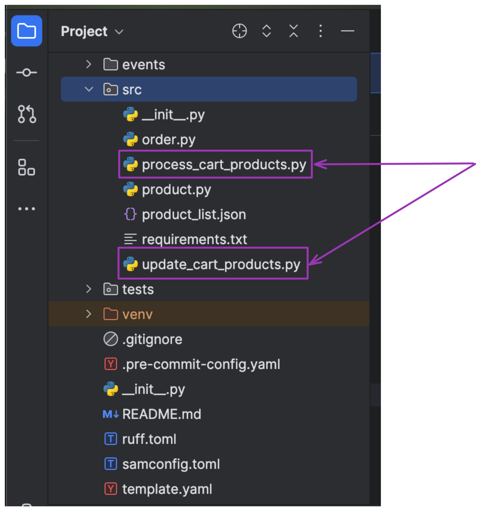
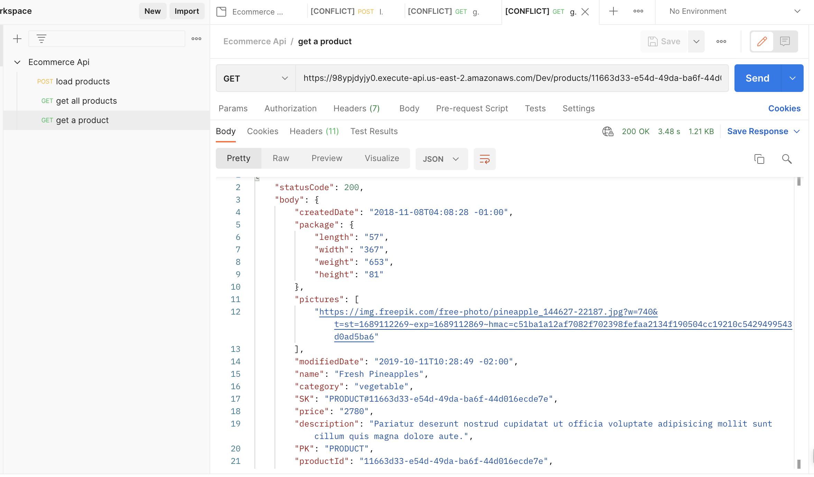
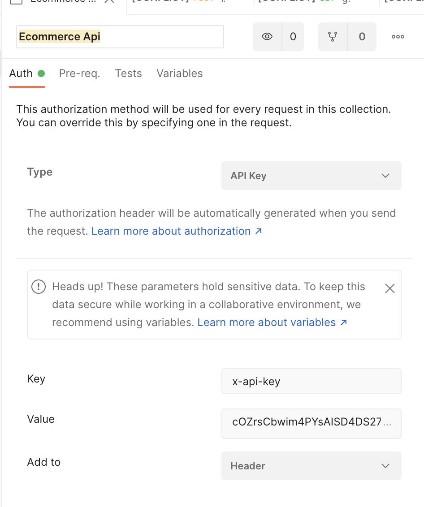

# Building a Secure Event Driven Api for an Ecommerce Platform.

# Rust as an addon for micro-optimizations over replacement

## Project Recap(add more content)
In a previous workshop, [Building event driven applications with AWS sam and python](https://www.educloud.academy/content/eb8782d3-4281-484e-9f4b-720857db74c0/)
we built a secure event driven serverless api for an ecommerce ordering service using python and AWS SAM.

In that workshop, we set up a lambda function to listen to newly created order events in the dynamoDB table using dynamodb streams, and then
sent the orders into an SQS Queue for processing. Another lambda function polls that SQS queue and updates the order record
in DynamoDB table.

In this workshop, we'll be rewriting the implementation of both lambda functions using Rust.

Why ?

Because Rust is extremely fast and way performant than Python.

We believe and have the figures to prove that, replacing these lambda functions indeed improved the
overall performance of your application.

## Prerequisites
To complete this workshop, you'll need
- An AWS Account
- A Python installation
- A [rust installation](https://www.rust-lang.org/tools/install)
- An understanding of how to build Serverless API's with AWS services.

## Clone the project
Please clone this repository , it has all configurations and starting code

---- add link to repo----

## Project Structure


Annotated on the screenshot are the 2 lambda functions we'll be rewriting in rust. Let's go ahead to
build and deploy the application, in order to make sure everything works well, before we start refactoring.

## Deploy Project
From the root of the project, navigate to the `src` folder and install all dependencies in the requirements.txt file
by running
`pip install -r requirements.txt`.
Once installed successfully, navigate out of the `src` folder and run the following commands to build and deploy
the application.

```bash
sam build
sam deploy --guided
```

Once deployed, you'll have to create an API KEY with a Usage plan in API gateway. Then use the API KEY
and API gateway endpoint generated as output from the deployment step to test the endpoints.

You can use postman or any other api testing software of your choice.





## Adding Rust to the project
We'll use `cargo`, Rust's package manager to initialize a host for rust.

From the root of this project, run the command

`cargo init`
This command initializes a rust project inside an already created folder. A couple of files have been added to the project.

- Cargo.toml file that'll contain all the crates for this project
- src folder(which already existed)
- main.rs file which we won't use.

Add the following to your samconfig.toml file:

```yaml
[default.build.parameters]
beta_features = true
[default.sync.parameters]
beta_features = true
```

## Process Cart Products
This lambda function listens to dynamodb streams Order events with order status as `ORDERED`, extracts the products
from the order and pushes them into an SQS Queue.

We've already provisioned resources for the lambda function and event source mapping in the `template.yaml` file.

### Event Source Mapping Resource
```yaml

  EventSourceDDBTableStream:
    Type: AWS::Lambda::EventSourceMapping
    Properties:
      BatchSize: 1
      Enabled: True
      FilterCriteria:
        Filters:
          - Pattern: '{ "dynamodb": { "NewImage": { "order_status": { "S": ["ORDERED"] } } } }'
      EventSourceArn: !GetAtt EcommerceAppTable.StreamArn
      FunctionName: !GetAtt ProcessCartProductsFunction.Arn
      StartingPosition: LATEST


```
### Lambda Function Resource

```yaml
  ProcessCartProductsFunction:
    Type: AWS::Serverless::Function # More info about Function Resource: https://docs.aws.amazon.com/serverless-application-model/latest/developerguide/sam-resource-function.html
    Metadata:
      BuildMethod: rust-cargolambda
      BuildProperties:
        Binary: process-cart-products
    Properties:
      CodeUri: ./
      Handler: bootstrap
      Runtime: provided.al2
      Description: Lambda function listens to dynamodb streams, gets order and sends order to sqs
      Architectures:
        - arm64
      Policies:
        - DynamoDBStreamReadPolicy:
            TableName: !Ref EcommerceAppTable
            StreamName:
              !Select [3, !Split ["/", !GetAtt EcommerceAppTable.StreamArn]]

    Connectors:
      SQSConnectors:
        Properties:
          Destination:
            Id: UpdateCartProductsSQS
          Permissions:
            - Write
```
#### What's happening above ?
In order to deploy rust code on lambda, AWS provides 2 runtimes `provided.al2023 or provided.al2`.
In this project, we're using the `provided.al2` runtime.

Because our template would contain more than one rust lambda function, we've added a binary parameter,
pointing to the binary of this lambda function defined in Cargo.yaml(Which we'll be looking at next).

`Binary: process-cart-products`

Handler is `bootstrap`, `codeUri` specifies where our rust code is located and build method is rust-cargoLambda.

To learn more about custom runtimes, see [Custom AWS Lambda runtimes](https://docs.aws.amazon.com/lambda/latest/dg/runtimes-custom.html) in the AWS Lambda Developer Guide

We've also added permissions for the lambda functions to read from a dynamodb stream and write to an SQS queue.

## Creating Process Cart Product Lambda Function
Inside the `src` folder, create a `bin` folder and then create a `lambda` folder inside the `bin` folder.

Create a file called `process-cart-products.rs` inside of the lambda folder.

So the folder structure now looks like so

```bash
  src
    |-bin
      |-lambda
        |- process-cart-product.rs

```

Open up the Cargo.yaml file and let's add the path and name to the Rust binary executable.


```toml
[[bin]]
name = "process-cart-products"
path ="src/bin/lambda/process-cart-products.rs"
test= false

```
Remember that the name `process-cart-products` was the same name we specified in the `template.yaml` file for `binary`.
A rust project can have multiple binaries.
